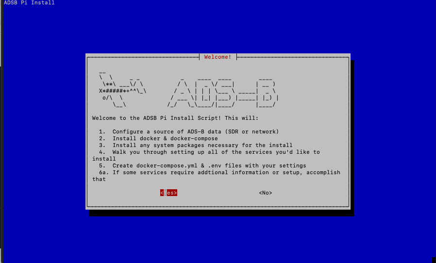

# Starting the Installer

Once you've gathered all the information you need, and have the Pi's hardware and Operating System installed issue the following command to get the installer started

```shell
/bin/bash -c "$(curl -fsSL http://adsb-pi.com/install-script)"
```

It will download the necessary files and you should be greeted with this screen

